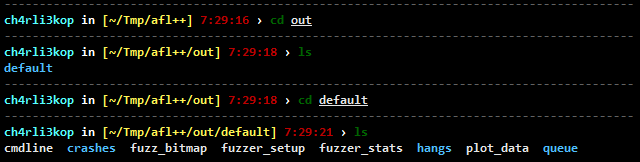

# ch4rli3.zsh-theme
lean & simple zsh theme

## How to install 
1. Copy `ch4rli3.zsh-theme` into `~/.oh-my-zsh/themes`.
2. Change `ZSH_THEME="ch4rli3"` in `~/.zshrc`.
3. Apply theme to command `source ~/.zshrc` in your terminal.

```shell
$ wget -O ~/.oh-my-zsh/themes/ch4rli3.zsh-theme https://raw.githubusercontent.com/ch4rli3kop/ch4rli3.zsh-theme/main/ch4rli3.zsh-theme
$ sed -i 's/ZSH_THEME="robbyrussell"/ZSH_THEME="ch4rli3"/' .zshrc
$ source ~/.zshrc
```

## Conda configuration

This theme displays the Python environment name (conda / venv) in the
prompt.

If Conda's default prompt modification is enabled, the environment name
may appear twice. Disable it with:

``` shell
$ conda config --set changeps1 false
```

You may also disable the default venv prompt:

``` shell
export VIRTUAL_ENV_DISABLE_PROMPT=1
```

Add it to your `~/.zshrc` if needed.

## Preview

